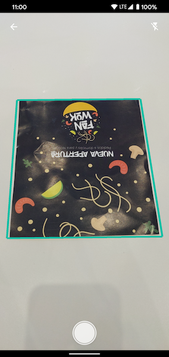
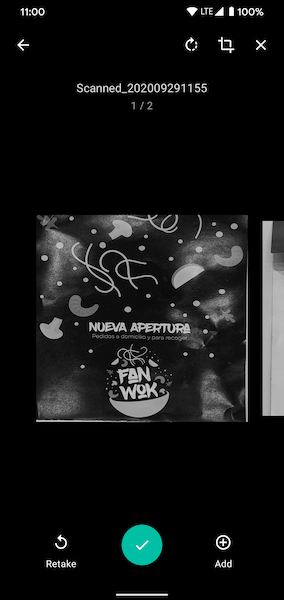
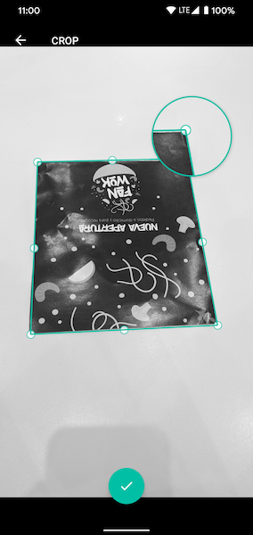

# Android Document Scanner Library

This library helps you to scan any document like CamScanner.

## Download

Step 1. Add it in your root `build.gradle` at the end of repositories:

	allprojects {
		repositories {
			...
			maven { url 'https://jitpack.io' }
		}
	}

Step 2. Add the dependency

	dependencies {
	        implementation 'com.github.meganz:AndroidDocumentScanner:TAG'
	}

## How to use

Call `DocumentScannerActivity` like following:

        Intent intent = DocumentScannerActivity.getIntent(this);
        startActivityForResult(intent, REQUEST_CODE_SCAN_DOCUMENT);

Get the result document on `onActivityResult()`:

        if (requestCode == REQUEST_CODE_SCAN_DOCUMENT) {
            if (resultCode == RESULT_OK) {
                Uri fileUri = intent.getData();
                String fileMimeType = intent.getType();

                // do something
            }
        }

Add the Activity to your `AndroidManifest.xml` file:

        <activity
            android:name="nz.mega.documentscanner.DocumentScannerActivity"
            android:launchMode="singleTop"
            android:screenOrientation="sensorPortrait"
            android:theme="@style/DocumentScannerTheme"
            android:windowSoftInputMode="stateHidden|adjustNothing"/>

You can set a custom `android:theme` to override the default one.

## Screenshots

|  |  |  |  |
|---|---|---|---|

## Thanks

* Thanks to *Mayuce* for the original idea. - https://github.com/mayuce/AndroidDocumentScanner
* Thanks OpenCV for this awesome library. - https://opencv.org/
* Inspiration from *aashari* . Thanks him for his source codes. - https://github.com/aashari/android-opencv-camera-scanner

## License

MIT License

Copyright (c) 2020 Muhammet Ali YUCE

Permission is hereby granted, free of charge, to any person obtaining a copy
of this software and associated documentation files (the "Software"), to deal
in the Software without restriction, including without limitation the rights
to use, copy, modify, merge, publish, distribute, sublicense, and/or sell
copies of the Software, and to permit persons to whom the Software is
furnished to do so, subject to the following conditions:

The above copyright notice and this permission notice shall be included in all
copies or substantial portions of the Software.

THE SOFTWARE IS PROVIDED "AS IS", WITHOUT WARRANTY OF ANY KIND, EXPRESS OR
IMPLIED, INCLUDING BUT NOT LIMITED TO THE WARRANTIES OF MERCHANTABILITY,
FITNESS FOR A PARTICULAR PURPOSE AND NONINFRINGEMENT. IN NO EVENT SHALL THE
AUTHORS OR COPYRIGHT HOLDERS BE LIABLE FOR ANY CLAIM, DAMAGES OR OTHER
LIABILITY, WHETHER IN AN ACTION OF CONTRACT, TORT OR OTHERWISE, ARISING FROM,
OUT OF OR IN CONNECTION WITH THE SOFTWARE OR THE USE OR OTHER DEALINGS IN THE
SOFTWARE.
